## Deploying A Stattic Website Using AWS S3 and CLoudFront

- Create a static website and host it on S3 bucket(private bucket)
- Using cloud front for CDN

### Introduction
# Static Website

A static website is just like any regular website. As the name implies, a static website has no dynamic component. A static website is usually made up of plain HTML files, CSS stylesheets, images, as well as Javascript files. It has no capabilities to perform any dynamic request or backend processing, such as processing form data or retrieving information from the database.

`Search for S3 in all services`
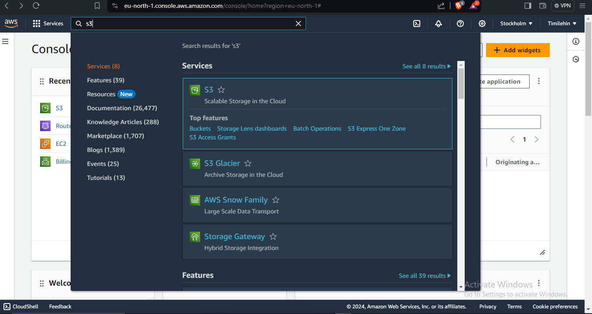

# then enter the bucket name

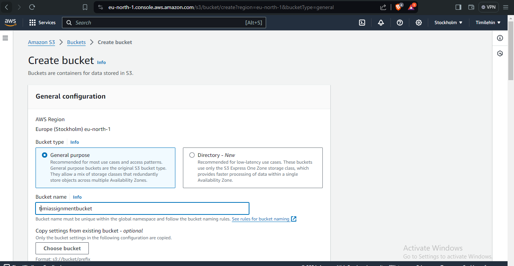

`Since we want to allow anyone to view our website, I untick the checkbox for Block all public access, and make sure to check the I acknowledge… statement checkbox below it.`
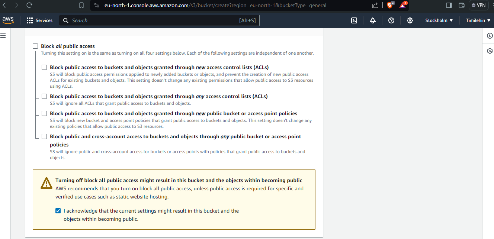

`Leave all other settings intact & click on the Create bucket button at the bottom of the page.`

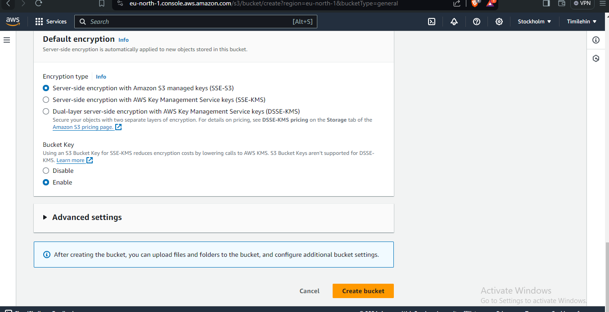

### Upload Website files to S3 Bucket
`After creating a new bucket, click on the bucket name to view the bucket details.`
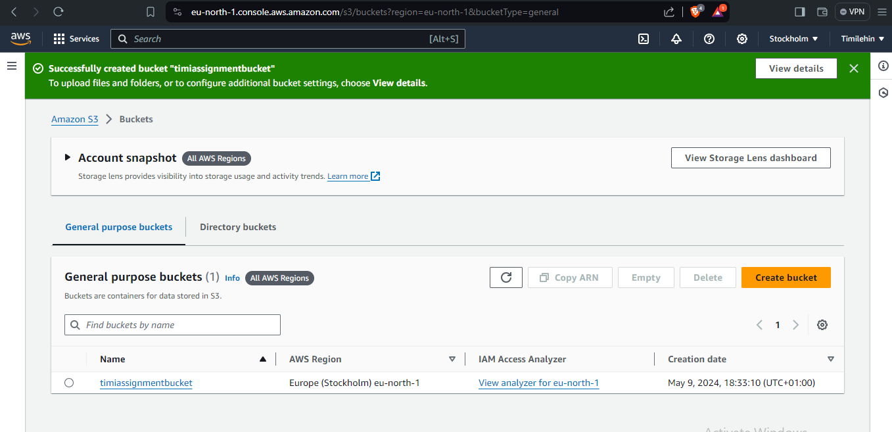

## When you create a new bucket it will be always empty. Click on the Upload button to upload some files

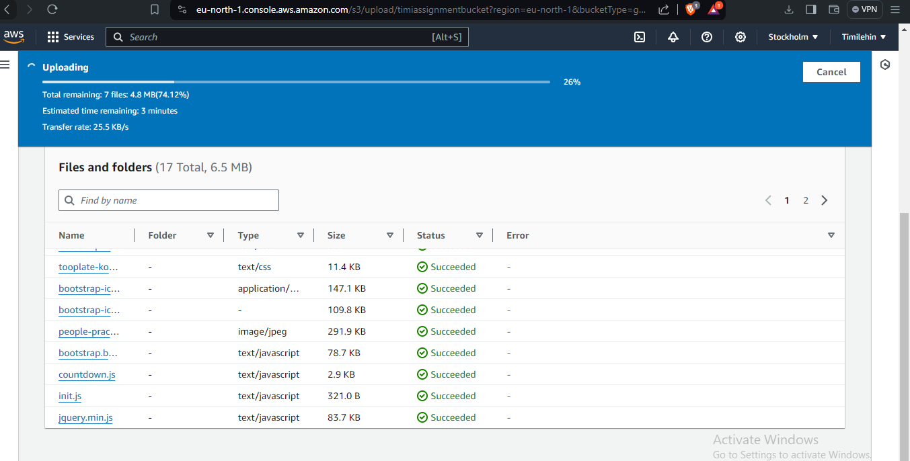

## Below is the image of the successfully uploaded file
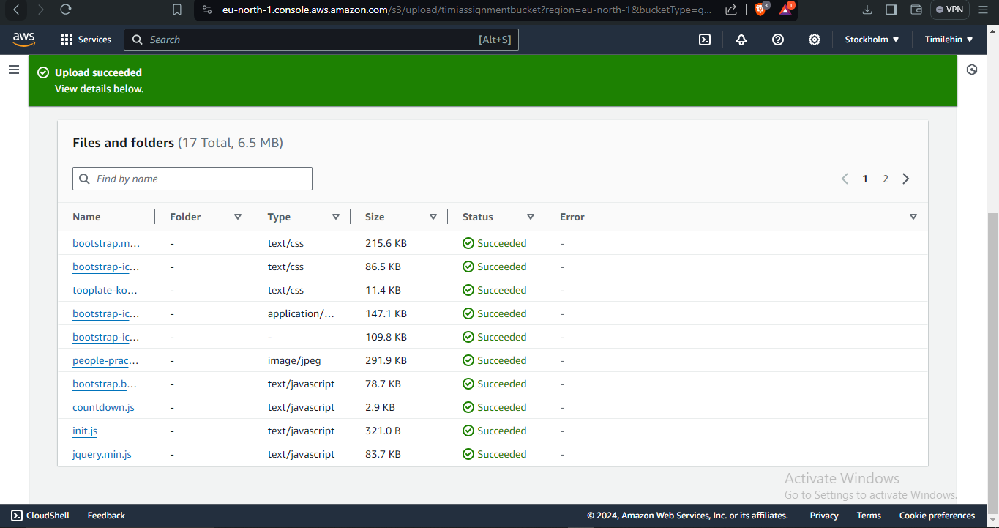

###  Enabling Static Website Hosting on S3 Bucket
`On the Bucket overview page, click on the Properties tab and scroll down.`
`I Look for Static website hosting section and click on the Edit button. `
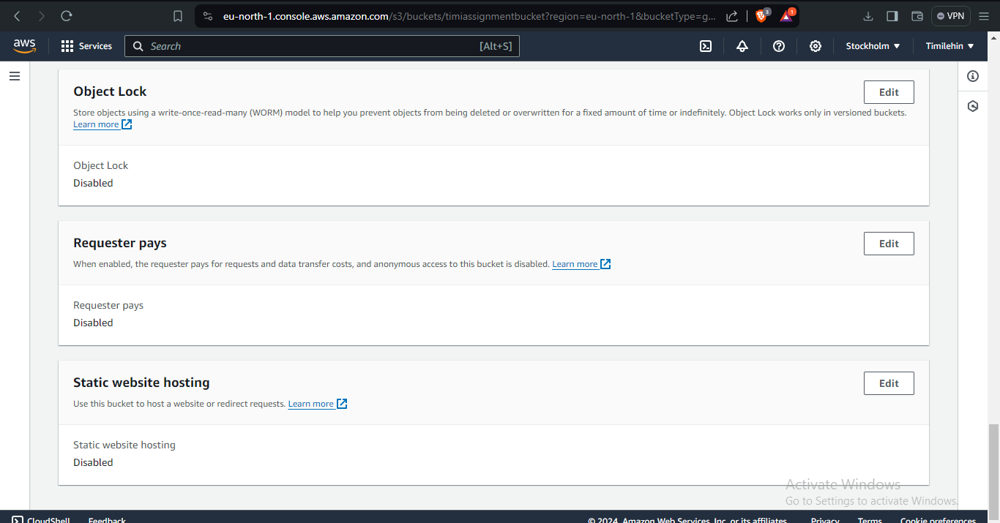
`Select Enable option for Static website hosting setting and you will be presented with more options as the following screenshot`
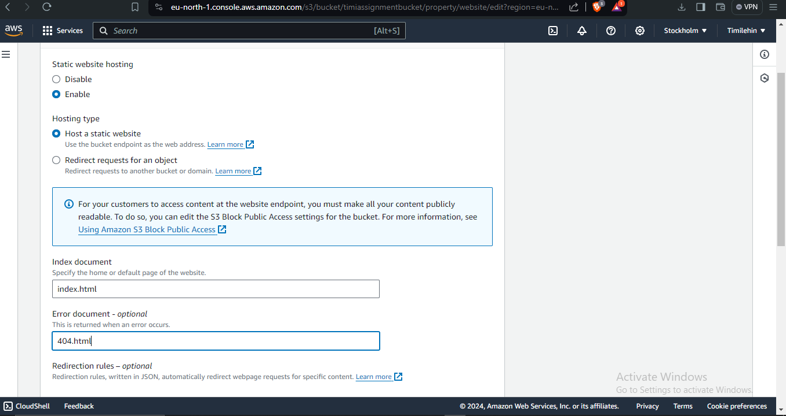
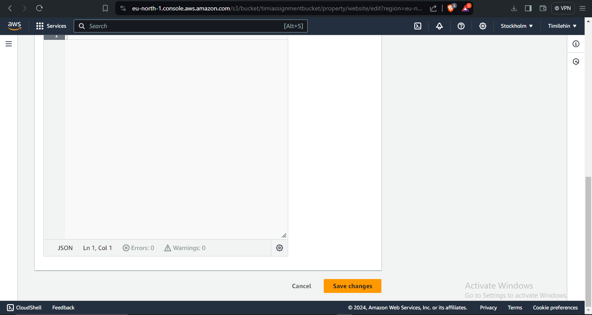

###  Add a Bucket Policy
- Before anyone could access the website on the bucket, we need to explicitly tell S3 Bucket to allow that.

- On the Bucket overview page, click on the Permissions tab, scroll down and look for Bucket policy section, and allow the following configuration.
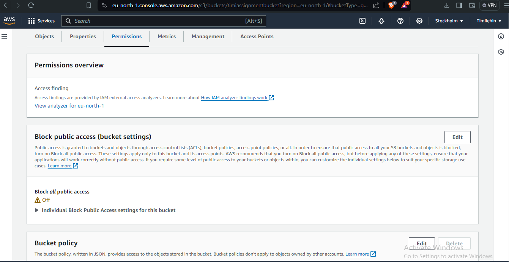

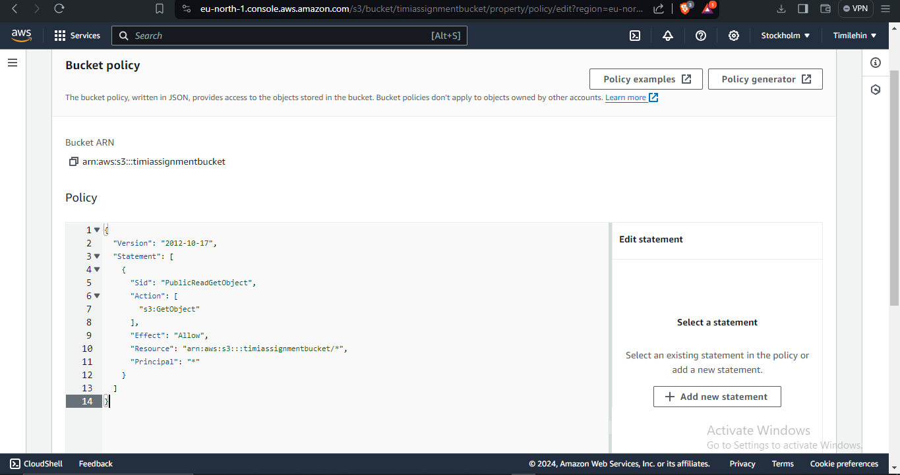

- and click `save changes` button

##### S3 Bucket Website Endpoint in the browser
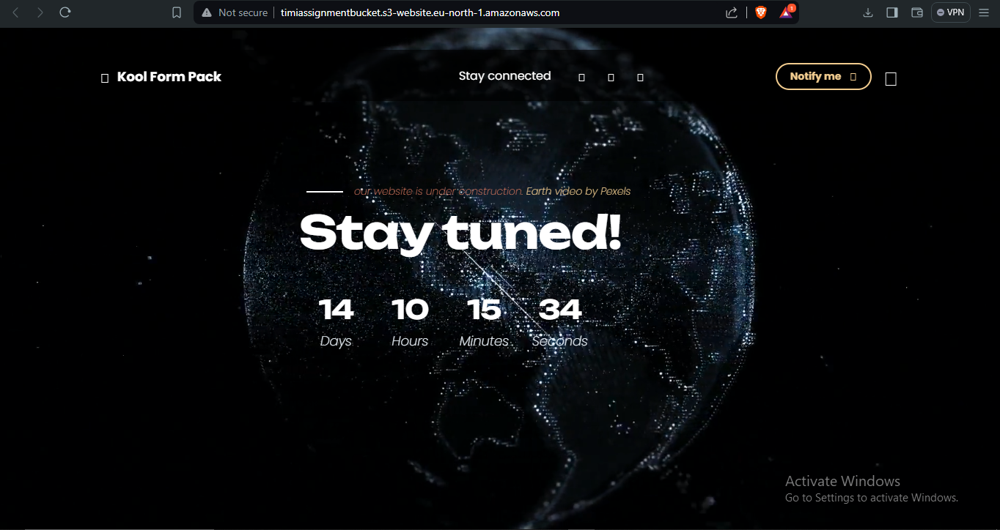

###### Creating a CloudFront Distribution
- From the top navigation under Services > All Services, 
- search for “CloudFront” and click on it.
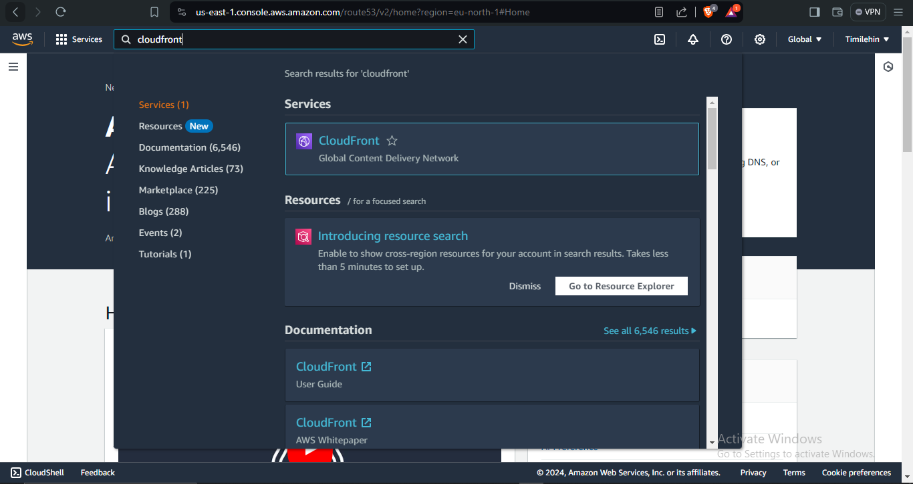

- On the CloudFront Distributions page, click on the Create distribution button

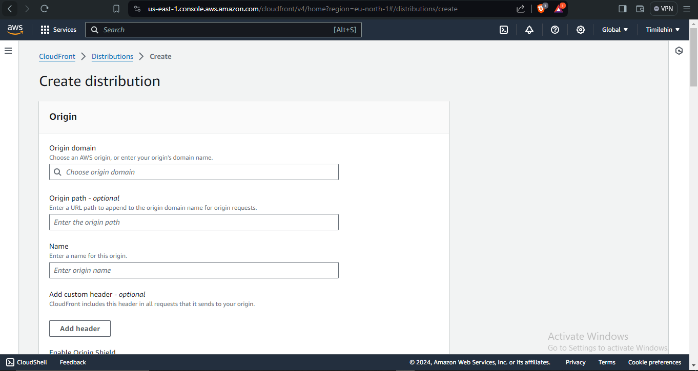

`On the Create distribution page > under Origin section > for Origin domain > I enter the Amazon S3 static website endpoint `

`Enter “index.html” for Default root object. This file name must match with the index document file name entered previously on S3, and click the create distribution button`

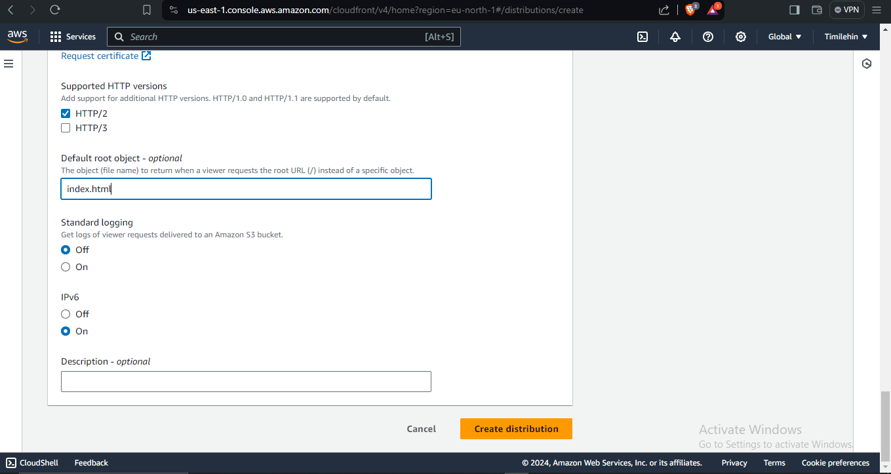

#### CREATED
##### DEPLOYING
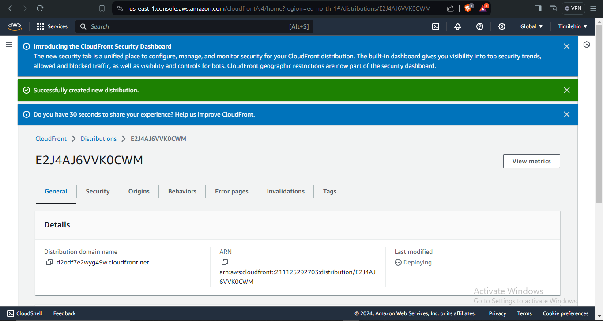

`Below is the distribution domain name tested on the browser `
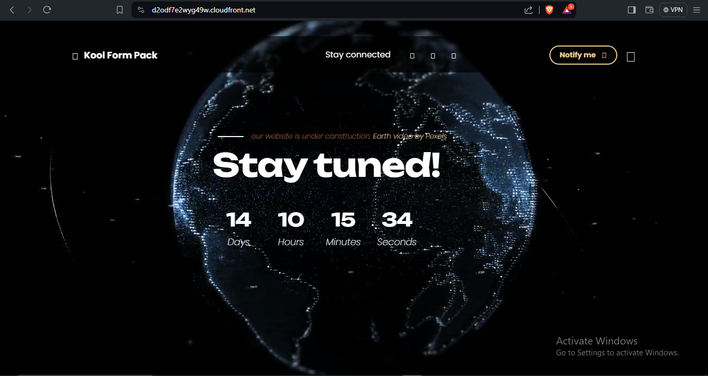

